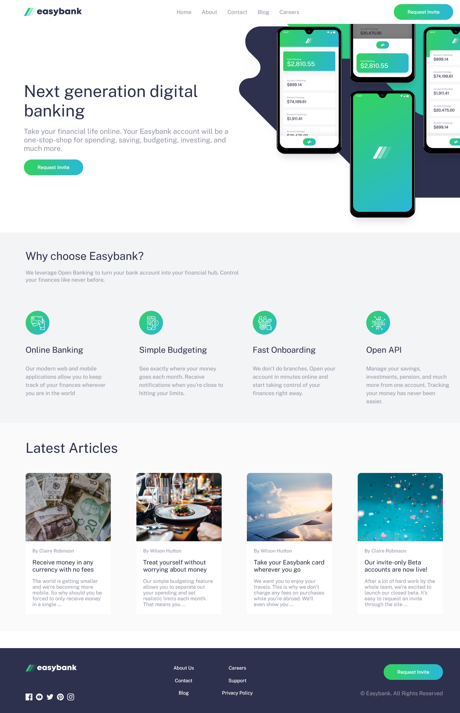

# Frontend Mentor - Easybank landing page

Esta vez realizamos un challenge más avanzado de la plataforma Front End Mentor,
una landing page que simula ser de un banco

### Captura de Pantalla

### Hecho con

- HTML
- CSS
- Styled-Components
- React Js
- Mobile-first workflow
- Flexbox

## Author

- Portafolio - [portafolio]()
- Front End Mentor - [@oscar84-spec](https://www.frontendmentor.io/profile/oscar84-spec)
- Linkedin - [Linkedin](https://www.linkedin.com/in/oscar-hdz202/)
